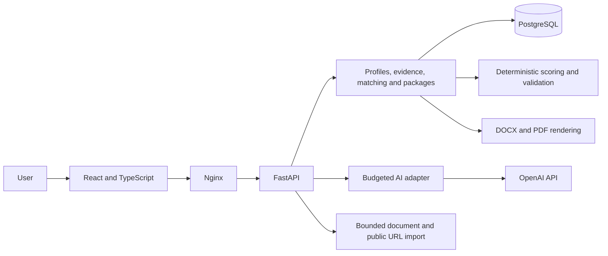

# JobHunter AI

[](https://github.com/ricardoportoIE/jobhunter-ai/actions/workflows/ci.yml)

**An evidence-led career assistant that helps people decide which vacancies to pursue and prepare applications they can stand behind.**

Job searching involves more than matching keywords. A useful decision needs to account for experience, evidence, missing information and requirements that cannot be negotiated. JobHunter AI brings these into one reviewable workflow: build a factual profile, assess a vacancy, prepare an application and track the outcome.

This portfolio project demonstrates full-stack development, applied AI, data modelling, security and automated testing through a working local application. Its central engineering principle is simple: **AI proposes; verifiable rules and human review control what becomes an accepted fact, a score or an approved document.**

**Available now:** a Docker-based local application with profile and vacancy imports, opt-in Greenhouse discovery, optional read-only Gmail alerts, evidence-backed matching, application documents, a manual tracker and a resumable local application rehearsal. The interface defaults to English (UK), with a persistent Portuguese option. All authored project documentation is in British English.

## The user journey

1. **Build a profile.** Upload a PDF, DOCX or Markdown CV, or enter information manually. AI creates an editable draft; the user can add, change or remove facts and evidence before confirming them.
2. **Understand a vacancy.** Import a public HTTPS link or paste the advertisement. Review the extracted role, requirements and source text before continuing.
3. **Assess the fit.** Examine each requirement against approved evidence. The application shows a deterministic score, evidence coverage, explicit blockers and questions that still need clarification.
4. **Prepare an application.** Review an AI-assisted strategy, select supported facts and generate CV and cover letter documents in DOCX/PDF. Check answers, differences and evidence before approving a specific package version.
5. **Rehearse the final review.** Review the exact application content, authorise a local simulation and receive a durable simulated receipt. Resume interrupted attempts without duplicate acceptance. Nothing is sent to an employer.
6. **Track the outcome.** Record real applications, interviews and outcomes. Employer submission takes place outside the application and is recorded explicitly by the user; a rehearsal preserves the real tracker status.

The workflow preserves drafts and form input, explains review requirements and guides the user to the next step. Desktop and mobile browser tests exercise both the successful journey and recovery from errors.

The [frontend experience](docs/frontend-experience.md) keeps the everyday journey focused: three main destinations, CV-first onboarding, filters for saved vacancies and expandable detail controls. AI can prepare the first assessment draft; the user confirms it before the deterministic score is calculated.

The [discovery workflow](docs/phase-4/operations.md) adds daily checks of sources the user enables. New and changed adverts retain provenance, while reviewed jobs are preserved until an explicit update. Email digests remain alerts with individual links to review. Gmail needs a separately configured Google OAuth client. Both connectors have synthetic regression coverage and recorded live checks; Gmail validation includes connection, label listing and alert import.

## Engineering skills demonstrated

| Area | Technologies and skills | How they are applied |
|---|---|---|
| Frontend engineering | React 19, TypeScript 6, Vite 8, CSS, internationalisation | Responsive screens, typed API calls, editable drafts, keyboard navigation, translated feedback and persistent language selection. |
| Backend engineering | Python 3.13, FastAPI, Pydantic, REST APIs | Validated contracts, authentication, domain services, explicit workflow transitions and consistent error responses. |
| Data engineering | PostgreSQL 17, SQL migrations, psycopg, JSONB | Versioned records, transactional audit events, ownership boundaries, evidence relationships and conflict detection. |
| Applied AI | OpenAI Responses API, structured outputs, embeddings, semantic retrieval | CV and vacancy extraction, cited matching, fact selection, second assessments and explicitly requested public web research. |
| Reliability and evaluation | Deterministic rules, contract validation, frozen evaluation sets | Reproducible scoring, source checks, clarification gates, disagreement handling and recorded model comparisons with stated limitations. |
| Security and privacy | Argon2, session cookies, CSRF protection, authorisation, SSRF controls | User isolation, protected writes, restricted public URL fetching, bounded document parsing and backend-only credentials. |
| External integrations | Greenhouse Job Board API, Gmail OAuth, PKCE, Fernet, conditional requests | Reviewed source activation, a bounded local worker, encrypted credentials, traceable updates and recovery from interrupted reads. |
| Workflow orchestration | Persistent state machines, scoped approvals, idempotency and reconciliation | Expiring authorisation bound to exact content, committed dispatch checkpoints, a local receipt receiver and recovery from lost acknowledgements or concurrent requests. |
| Document processing | pypdf, python-docx, ReportLab | Importing source material and producing reviewable DOCX/PDF documents from approved facts. |
| Quality assurance | pytest, Vitest, Testing Library, Playwright, axe | Domain, API, database, component and browser tests, including failure recovery, accessibility checks and desktop/mobile journeys. |
| Developer tooling and delivery | Docker Compose, Nginx, GitHub Actions, uv, npm, Ruff, mypy, ESLint, Prettier | Reproducible environments, locked dependencies, static analysis, production builds, health checks and continuous integration. |
| Cloud engineering and operations | Terraform, EC2, IAM, Systems Manager, S3, CloudWatch, EventBridge Scheduler | Private temporary environments, verified database recovery, atomic cost reservations, automatic termination and audited teardown. |
| Product and architecture | Modular monolith, threat modelling, architecture decision records | A scoped product, documented trade-offs, reviewable decisions and a clear separation between implemented features and future plans. |

For a focused code review, start with the [scoring engine](apps/api/src/jobhunter_api/scoring.py), [AI validation](apps/api/src/jobhunter_api/ai_matching.py), [CV import](apps/api/src/jobhunter_api/cv_import.py), [public URL reader](apps/api/src/jobhunter_api/job_url.py) and [browser journeys](apps/web/e2e).

## How reliability is built in

- **Evidence before claims.** Facts retain their source, review status, permitted uses and validity. CV excerpts are resolved from validated source ranges; generated documents use approved facts.
- **Rules own the decision boundaries.** Code calculates weights and scores. Desirable skills cannot compensate for an explicit disqualifier, and permission to pursue an offer remains separate from permission to start employment.
- **Uncertainty remains visible.** Missing decisive information, conflicting evidence and title/body disagreements require clarification. Different assessments are preserved for review rather than silently selecting the most favourable result.
- **Approval belongs to a version.** Changes to source information invalidate affected approvals. A previously approved package is not treated as current after its supporting evidence changes.
- **Delivery has its own permission.** P6 requires separate, expiring authorisation for its local sandbox. An uncertain result is checked before another attempt, and a simulated receipt never implies employer delivery.
- **AI calls are accountable.** A cost ledger reserves and settles usage, caches equivalent requests and blocks further calls when unresolved usage requires reconciliation. Model, reasoning effort and prompt settings are configurable by task within a validated catalogue.
- **External content is untrusted.** Document parsing has size, time and resource limits. URL imports check destinations and redirects, respect source restrictions and do not bypass authentication or CAPTCHAs.

The project includes [model comparison evidence](docs/evals/model-comparison.md) and [subsequent workflow evaluations](docs/evals/luna-migration.md). These are small, recorded experiments, including synthetic cases and historical vacancy snapshots. They do not establish general model superiority or predict hiring outcomes; failures and label limitations remain in the reports.

## Architecture

The application is a **modular monolith**: one API, one database and explicit boundaries between the browser, domain rules and external services. This keeps local development practical while making the important decisions independently testable.



The browser never receives the provider key or database credentials. Local services bind to loopback. The API and web containers run without root; the runtime database account is separate from the administrative account. AI features send the context needed for the requested task to the configured provider, so local hosting does not mean that AI processing is offline.

```text
apps/api/       FastAPI application, domain logic, migrations and tests
apps/web/       React application, component tests and browser journeys
data/          Synthetic fixtures and recorded evaluation artefacts
docs/          Product decisions, architecture, operations and validation
schemas/       Design-time data contracts
scripts/       Setup, health checks, evaluation and documentation validation
.github/       Continuous integration workflow
```

## Run locally

### Prerequisites

- Docker Desktop using Linux containers, with Docker Compose supporting `--wait`.
- Python and uv **0.12.7**. The API uses Python **3.13**, which uv can install when needed.
- Node.js **24** and npm for frontend development and browser tests; they are not required on the host for the Docker-based application.
- An OpenAI API key with billing and access to the configured models for AI features. The manual workflow can run without a key.

From the repository root, run:

```powershell
python scripts/init_env.py
docker compose up --build --detach --wait --wait-timeout 120
uv sync --project apps/api --locked
uv run --project apps/api --env-file .env python -m jobhunter_api.manage bootstrap
python scripts/smoke_local.py
```

Open **http://127.0.0.1:5173** and sign in as `local` using the generated password in `.private/local-login.txt`. API documentation is available at **http://127.0.0.1:5173/api/docs**. The initialiser preserves existing configuration and bootstrap preserves an existing account.

To enable AI, import a key from a local file; replace `PATH_TO_KEY_FILE` with its path:

```powershell
python scripts/configure_openai.py PATH_TO_KEY_FILE
docker compose up --detach --wait api
```

Keys stay in the backend configuration. `.env`, `.private/`, local exports and source CVs must stay outside version control. The default project limits are **EUR 10 per month for AI** and **EUR 25 combined**; these are application settings, not a guarantee about provider billing. Check [AI configuration and operations](docs/phase-2/operations.md) and [task-specific model settings](docs/evals/luna-migration.md) before changing providers or models. Model access depends on the API account.

Stop the application with `docker compose down`; this retains the database. See the [development guide](docs/local-development.md) for automatic reload, alternative ports, synthetic seed data and troubleshooting.

## Testing and validation

The [GitHub Actions workflow](.github/workflows/ci.yml) defines six jobs: API, frontend, Docker Compose, browser end-to-end tests, design contracts and temporary infrastructure. It checks formatting, types, application behaviour, evaluation contracts, builds, database outage recovery, mocked Terraform plans and cloud budget/recovery controls. Automated tests use synthetic data; CI does not deploy AWS resources or make paid AI calls.

Verification on **24 September 2026** passed **192 API tests, 36 frontend tests and 16 desktop/mobile browser tests**, with no skipped API tests. Static checks, Python types, package and frontend builds, evaluation contracts and documentation checks passed. Two upstream Python deprecation warnings remain. Linux containers and Chromium avoid the local Windows restriction on the managed Python interpreter. See [P6 validation](docs/phase-6/validation.md) for measured results, [P4 validation](docs/phase-4/validation.md) for discovery coverage and the [P5 runbook](docs/phase-5/runbook.md) for infrastructure checks.

The **28 infrastructure and recovery checks** also passed locally, bringing the P6
total to **272 automated test cases and Terraform test runs**. P6 adds 27 API cases
and five component cases, and extends both document browser journeys with sandbox
review and recovery. There were no duplicate receipts or unauthorised acceptances
in those scenarios. No paid inference or AWS deployment was needed.

The earlier P5 delivery recorded 240 cases and runs. All six jobs passed in the
[verified P5 CI run](https://github.com/ricardoportoIE/jobhunter-ai/actions/runs/35928117735).

| P5 delivery metric | Verified result |
|---|---|
| Real AWS validation | Two attempts; the corrected cold start required no manual intervention |
| Backup and recovery | 2/2 passed, including downloaded SHA-256 and restored-record checks |
| Automatic compute termination | 2/2 Scheduler tests passed |
| Final cleanup | 38 residual checks clear; zero remaining session resources |
| Cost control | EUR 4.16 combined estimate within one retained EUR 5 reservation; final billing pending |

The final AWS audit at **22:27–22:28 UTC on 23 September 2026** also found no P5
buckets, schedules, log groups or alarms. Both Terraform states are empty. The
[validation report](docs/phase-5/validation.md) and [metrics snapshot](docs/phase-5/metrics.json)
record timings, backup sizes, scope and limitations. These are measured demonstration
results, not production availability or performance claims. No permanent AWS endpoint
is running, and no new deployment is required to run CI.

Run the API tests against a separate test database, with the local PostgreSQL service running:

```powershell
$env:JOBHUNTER_TEST_DB_NAME='jobhunter_test'
uv run --project apps/api --locked --env-file .env pytest apps/api/tests
```

Run frontend and browser tests:

```powershell
cd apps/web
npm ci
npm test
npx playwright install chromium
npm run test:e2e
```

On Windows, an installed Microsoft Edge can be used by setting `$env:PLAYWRIGHT_CHANNEL='msedge'` before `npm run test:e2e`. Browser tests use disposable test data and their own application servers.

From the repository root, validate the design contracts and documentation:

```powershell
python -m venv .venv
.venv\Scripts\python -m pip install -r requirements-phase0.txt
.venv\Scripts\python scripts/validate_phase0.py
python scripts/check_documentation.py
```

The [development guide](docs/local-development.md) lists the lint, type, build and recovery commands; the workflow is the complete CI checklist. PostgreSQL tests skipped because no test database was configured do not count as a full pass. Live model probes are separate, explicit operations described in the evaluation guides.

## Project scope and next steps

The local core, AI assistance, application packages, discovery and P6 sandbox orchestration are implemented. P5 provides a temporary, private AWS demonstration with synthetic data: one EC2 host runs the Docker stack, SSM provides private access, S3 holds recovery artefacts and CloudWatch records readiness. Terraform and two termination mechanisms support a bounded lifecycle. The [live P5 validation](docs/phase-5/validation.md) passed deployment, recovery, scheduled termination and verified teardown. The demonstration resources have been removed; P6 does not recreate them.

The project supports individual use with human review. Gmail is optional and requires the operator's OAuth client and explicit consent. Everyday use remains local; there is no hosted production service or automated application submission. The smaller [P5 topology](docs/adr/0005-temporary-aws-demo.md) was selected to fit the temporary demonstration budget. RDS, Fargate, Cognito, API Gateway and other services in the original conceptual architecture are not claimed as implemented capabilities.

The [P6 workflow](docs/phase-6/operations.md) uses PostgreSQL transactions and checkpoints,
with separate human approval, cancellation and reconciliation. A local receiver makes
the failure cases reproducible without contacting employers. No additional orchestration
framework was required; see [ADR-006](docs/adr/0006-controlled-submission.md).

Further work includes broader user-labelled evaluations, testing with more document layouts and sources, and a carefully scoped pilot:

| Planned stage | Skills and technologies to develop | Intended purpose |
|---|---|---|
| Permitted external channel pilot | Channel-specific permission, credentials, integration contracts and outcome reconciliation | Extend the tested sandbox workflow only after a real channel is selected and explicitly authorised. |

The P5 demonstration does not enable paid inference; Bedrock and AgentCore remain deferred until a measured requirement justifies them. Temporary cloud environments must fit the project's cost constraints. See the [product brief](docs/phase-0/product-brief.md), [architecture](docs/architecture/overview.md) and [runtime decision](docs/adr/0002-ai-runtime.md) for the reasoning behind this scope.

## Explore the project

| If you want to understand… | Start here |
|---|---|
| The product and its users | [Product brief](docs/phase-0/product-brief.md) |
| Imports, draft review and languages | [User workflow guide](docs/imports-and-languages.md) |
| Architecture and design trade-offs | [Architecture](docs/architecture/overview.md) · [AI runtime decision](docs/adr/0002-ai-runtime.md) · [Evidence and approval](docs/adr/0003-evidence-and-approval.md) |
| Security, ownership and personal data | [Threat model](docs/security/threat-model.md) · [Privacy and erasure](docs/phase-1/security-and-data.md) |
| AI quality, costs and limitations | [AI operations](docs/phase-2/operations.md) · [Evaluation results](docs/phase-2/validation.md) · [Model migration evidence](docs/evals/luna-migration.md) |
| Application documents and approval | [Package workflow](docs/phase-3/operations.md) · [Validation and visual checks](docs/phase-3/validation.md) |
| Discovery, alerts and source updates | [Operations](docs/phase-4/operations.md) · [Gmail setup](docs/phase-4/gmail-setup.md) · [P4 validation](docs/phase-4/validation.md) |
| Temporary AWS delivery and recovery | [Session runbook](docs/phase-5/runbook.md) · [Live validation](docs/phase-5/validation.md) · [Infrastructure](infra/p5/README.md) |
| Development and documentation conventions | [Local development](docs/local-development.md) · [Documentation policy](docs/documentation-policy.md) · [Project conventions](AGENTS.md) |

Public fixtures are fictitious. Real-vacancy evaluation cases are paraphrased and pseudonymised; their design labels are not a complete human gold set. Personal CVs, contact details, original private evidence and credentials are excluded from the repository.
