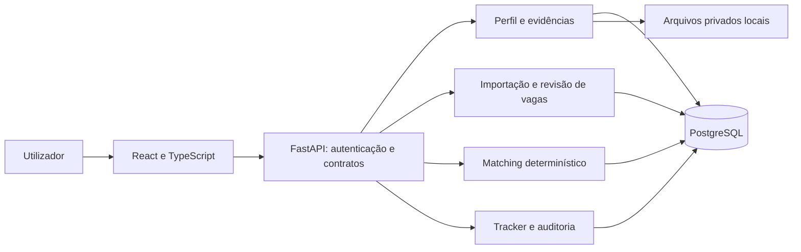
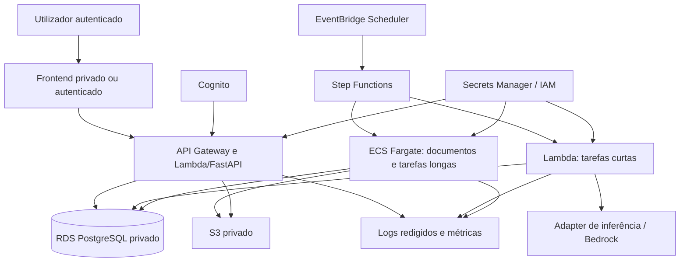
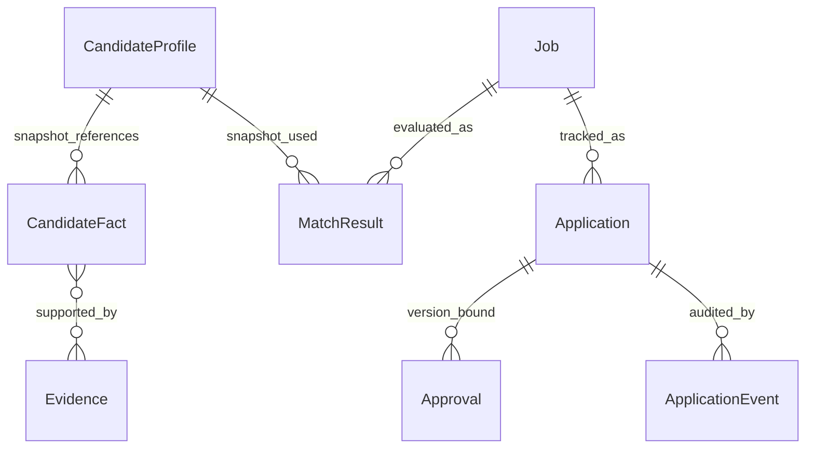

# Arquitetura definida na fase 0

Baseline adotado: aplicação local, monólito modular e AWS apenas para validações temporárias. O teto €25/mês torna a topologia cloud abaixo um ambiente efêmero de demonstração; ela não será mantida como produção pessoal contínua. Ver [ADR-004](../adr/0004-local-first-budget.md).

## Núcleo local — fase 1

Um backend, um banco e módulos com limites explícitos. Domínio não importa FastAPI, SDK de LLM ou detalhes AWS. Adaptadores convertem contratos externos para o domínio. React consome API; não acessa banco, providers ou segredos diretamente. Aplicação e banco locais ficam limitados ao loopback, com credenciais locais fora do Git.

Estrutura futura mínima: `apps/api`, `apps/web`, `packages/domain`, `tests`, `infrastructure`. Workers, renderer, MCP e pacotes de agentes surgem apenas quando suas fases precisarem deles. Os diretórios de aplicação ainda não foram criados.

## Evolução AWS — referência para fase 5

O diagrama é lógico: rede, endpoints privados, quotas e disponibilidade regional precisam de design detalhado e cotação antes do Terraform. RDS continua tendo custo fixo mesmo com processamento por eventos. A demonstração temporária pode usar Single-AZ e é destruída depois da validação. Dados canônicos permanecem locais; não há promessa de disponibilidade cloud contínua.

Step Functions controla tarefas cloud, retries e agendamento. LangGraph, quando necessário, controla estados internos de uma análise por IA. Estado de candidatura e aprovação pertence ao banco/domínio. Não duplicar a mesma máquina de estados nos três lugares.

## Dados e relações

Perfil, vaga e matching são versionados. Unicidade de candidato + vaga impede duplicação acidental de candidatura; novas tentativas explícitas terão modelo próprio se necessárias. Escrita do estado e evento de auditoria ocorre na mesma transação. Uma chave de idempotência é vinculada ao ator, operação e hash do payload; reutilização com payload diferente retorna conflito.

## Máquina de estados

Pipeline de inteligência da vaga: `DISCOVERED → PARSED → SCORED`. `PARSED` requer revisão manual dos campos na fase 1. A shortlist cria uma `Application` em `SHORTLISTED`; a vaga mantém seu estágio de análise. Isso separa reanálises de resultados de candidaturas.

| Estado atual da candidatura | Próximos estados normais | Condição |
|---|---|---|
| SHORTLISTED | RESEARCHED, PACKAGE_GENERATED | Pesquisa é opcional no MVP local; geração exige matching válido |
| RESEARCHED | PACKAGE_GENERATED | Snapshot factual e estratégia definidos |
| PACKAGE_GENERATED | NEEDS_REVIEW | Validação do pacote passou |
| NEEDS_REVIEW | APPROVED, PACKAGE_GENERATED | Aprovar versão ou pedir alterações; recusa de pacote permanece em revisão |
| APPROVED | SUBMITTED, NEEDS_REVIEW | Envio/registro manual comprovado ou invalidação da aprovação |
| SUBMITTED | INTERVIEWING, OFFERED, REJECTED | Evidência do resultado; não inferir sucesso por timeout |
| INTERVIEWING | OFFERED, REJECTED | Resultado registrado pelo utilizador |
| OFFERED, REJECTED, WITHDRAWN, EXPIRED | Nenhum | Terminais; correções exigem evento administrativo explícito |

Dos estados não terminais é permitido `WITHDRAWN`; `EXPIRED` é permitido antes de submissão. `ARCHIVED` é um marcador da vaga, independente do resultado da candidatura. Na fase 1, pacote e envio automatizado não existem: tracker pode registrar uma submissão manual com confirmação explícita, origem `manual_record` e data/comprovante. A exceção não pode ser usada pelo adaptador automatizado futuro.

Alteração do perfil, vaga, evidência ou pacote invalida a aprovação afetada. Envio futuro precisa de aprovação separada de escopo `submission`, destinatário/canal, hash do pacote e prazo. Se o resultado externo ficar ambíguo, registrar tentativa `UNKNOWN` fora do estado principal e reconciliar antes de tentar novamente.

## Fronteiras de confiança

1. Browser → API: autenticação, autorização por proprietário e validação de entrada.
2. Fontes externas → parser: dados não confiáveis, limites e isolamento.
3. Domínio → IA: somente contexto necessário, sem credenciais ou dados sensíveis dispensáveis.
4. Domínio → canal de candidatura: aprovação válida, idempotência e confirmação de resultado.
5. Banco/arquivos → logs: apenas metadados redigidos.
