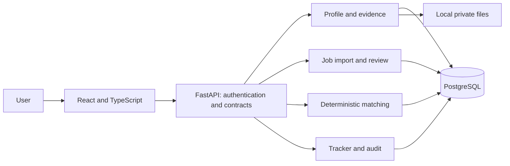
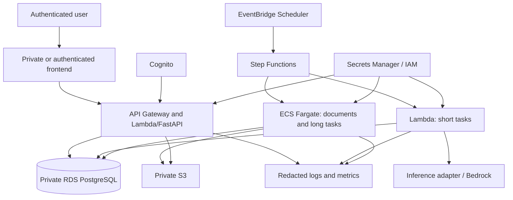
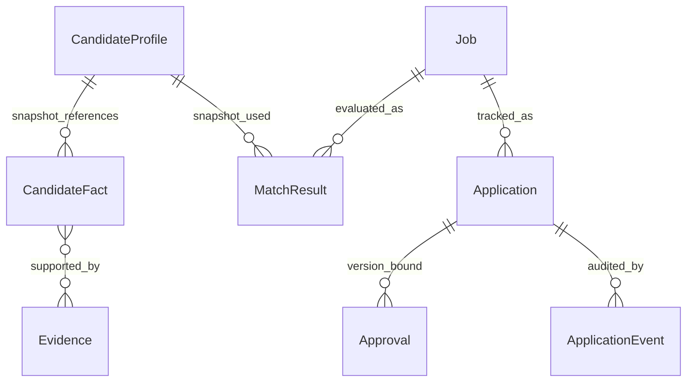

# Architecture defined in phase 0

Adopted baseline: a local application, modular monolith and AWS only for temporary validation. The €25/month ceiling makes the cloud topology below an ephemeral demonstration environment; it will not run as continuous personal production infrastructure. See [ADR-004](../adr/0004-local-first-budget.md).

P5 implementation note: [ADR-005](../adr/0005-temporary-aws-demo.md) replaces the
multi-service cloud reference below with one disposable EC2/Docker host, private
SSM access, S3 recovery artefacts, CloudWatch and Scheduler. The reference diagram
is retained as the original design, not a claim that every service was deployed.

## Local core — phase 1

One backend, one database and modules with explicit boundaries. The domain does not import FastAPI, an LLM SDK or AWS details. Adapters convert external contracts into domain objects. React consumes the API; it does not access the database, providers or secrets directly. The local application and database are restricted to loopback, with local credentials kept outside Git.

Implemented structure: `apps/api` and `apps/web`, with tests alongside each application and validation scripts at the root. The pure scoring engine is in `jobhunter_api/scoring.py`, without FastAPI or PostgreSQL. Workers, the renderer, MCP and cloud infrastructure are introduced when their phases need them. [Contracts implemented in phase 1](../phase-1/runtime-contracts.md).

## Local discovery — phase 4

P4 adds a local `discovery` worker sharing the API package and database. Reviewed
source records determine whether a fixed provider connector can run. A session lock
serialises provider batches, short transactions claim/finalise runs and snapshots
preserve source revisions. Gmail OAuth credentials use a separate encrypted table;
source content remains untrusted. See [discovery operations](../phase-4/operations.md).

## AWS evolution — reference for phase 5

This is a logical diagram: networking, private endpoints, quotas and regional availability need detailed design and pricing before Terraform implementation. RDS still has a fixed cost with event-driven processing. The temporary demonstration may use Single-AZ and is destroyed after validation. Canonical data remains local; continuous cloud availability is not promised.

Step Functions controls cloud tasks, retries and scheduling. LangGraph, when needed, controls the internal states of an AI analysis. Application and approval state belongs to the database/domain. Do not duplicate the same state machine across all three.

## Data and relationships

Profiles, jobs and matches are versioned. Candidate + job uniqueness prevents accidental duplicate applications; explicit new attempts will have their own model if needed. State and audit events are written in the same transaction. An idempotency key is bound to the actor, operation and payload hash; reuse with a different payload returns a conflict.

## State machine

Job intelligence pipeline: `DISCOVERED → PARSED → SCORED`. `PARSED` requires manual field review in phase 1. Shortlisting creates an `Application` in `SHORTLISTED`; the job retains its analysis stage. This separates reanalysis from application outcomes.

| Current application state | Normal next states | Condition |
|---|---|---|
| SHORTLISTED | RESEARCHED, PACKAGE_GENERATED | Research is optional in the local MVP; generation requires a valid match |
| RESEARCHED | PACKAGE_GENERATED | Factual snapshot and strategy defined |
| PACKAGE_GENERATED | NEEDS_REVIEW | Package validation passed |
| NEEDS_REVIEW | APPROVED, PACKAGE_GENERATED | Approve the version or request changes; package rejection remains under review |
| APPROVED | SUBMITTED, NEEDS_REVIEW | Confirmed submission/manual record or invalidated approval |
| SUBMITTED | INTERVIEWING, OFFERED, REJECTED | Evidence of the outcome; do not infer success from a timeout |
| INTERVIEWING | OFFERED, REJECTED | Outcome recorded by the user |
| OFFERED, REJECTED, WITHDRAWN, EXPIRED | None | Terminal; corrections require an explicit administrative event |

`WITHDRAWN` is permitted from non-terminal states; `EXPIRED` is permitted before submission. `ARCHIVED` is a job marker, independent of the application outcome. Phase 1 has no automated package generation or submission: the tracker can record a manual submission with explicit confirmation, origin `manual_record` and a date/supporting record. The future automated adapter must not use this exception.

A change to the profile, job, evidence or package invalidates the affected approval.
P6 implements separate approval with `submission:sandbox` scope, a fixed local recipient,
payload/package hashes and expiry. Its workflow states are separate from the conceptual
application lifecycle above: `NEEDS_REVIEW → APPROVED → DISPATCHING → SIMULATED`, with
`UNKNOWN`, `FAILED` and `CANCELLED` recovery states. Simulation never changes the tracker
to `SUBMITTED`. An ambiguous attempt must be reconciled before retrying. See
[ADR-006](../adr/0006-controlled-submission.md) and [P6 operations](../phase-6/operations.md).

## Trust boundaries

1. Browser → API: authentication, owner-based authorisation and input validation.
2. External sources → parser: untrusted data, limits and isolation.
3. Domain → AI: only necessary context, without credentials or unnecessary sensitive data.
4. Domain → application channel: valid approval, idempotency and outcome confirmation.
5. Database/files → logs: redacted metadata only.
